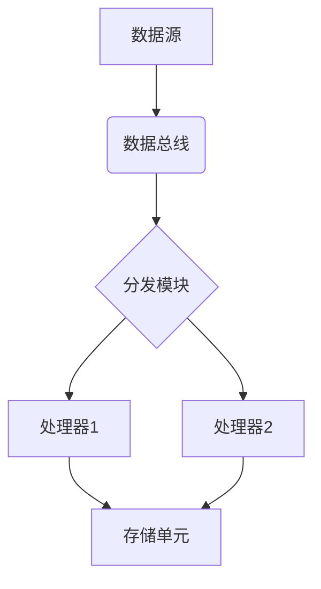

# 数据总线实现  

## 1.数据总线简介  
$$
\frac{1}{2}
$$  

## 2.数据片轮转 
- 1.数据总线定义  
- 2.数据轮转定义  

```mermaid
graph TD
    A[数据源] --> B(数据总线)
    B --> C{分发模块}
    C --> D[处理器1]
    C --> E[处理器2]
    D --> F[存储单元]
    E --> F
```
